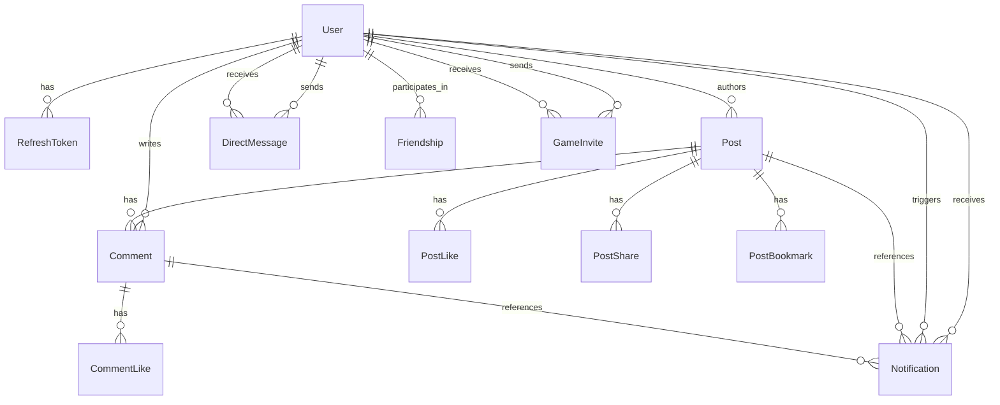

_This project has been created as part of the 42 curriculum by mstrauss, kruseva, jmuhlber, vmamoten._

# 🪐 ft_transcendence

## 📖 Description

ft_transcendence is the final project of the 42 Common Core. It is a full-stack social web application that combines community features with a real-time multiplayer Pong experience.
The goal of the project is to build a modern platform where users can create profiles, connect with other users, share content, communicate in real time, and launch live matches directly from the application. The project combines a React frontend, an Express backend, Prisma-managed PostgreSQL data, and WebSocket-powered real-time features into a single containerized application.

**Key Features:**

- **Social Platform:** User profiles, friendship management, direct messaging, notifications, and a shared social feed with posts, comments, bookmarks, and media uploads.
- **Real-Time Interaction:** Socket.IO-powered messaging, live updates, typing indicators, unread state, and in-app game invites.
- **Gameplay:** A browser-playable 3D Pong game with remote multiplayer support and live synchronized match state.
- **Technical Foundation:** A framework-based full-stack architecture using React, Express, Prisma, PostgreSQL, and a reusable custom design system.
- **User Experience:** Search, pagination, protected media handling, and integrated file upload flows for avatars, posts, and chat attachments.

---

## 🛠 Instructions

### Prerequisites

- Git
- Docker Engine or Docker Desktop
- Docker Compose v2 (`docker compose`)

### Installation & Execution

This project uses Docker for the full application stack, including the frontend, backend, database, reverse proxy, and optional Adminer instance.

1. **Clone the repository:**

   ```bash
   git clone <your-repository-url>
   cd ft_transcendence
   ```

2. **Environment Setup:**
   Create a `.env` file in the root directory based on the provided example:

   ```bash
   cp .env.example .env
   ```

   Review the following values before starting the stack:
   - `JWT_SECRET`
   - `PROXY_HTTP_PORT`, `PROXY_HTTPS_PORT` (should be 8080 and 8443 on 42 machines)
   - `TLS_CERT_HOSTS`
   - `CORS_ALLOWED_ORIGINS`

   If you want to access the app from another machine on your network, append your host IP or domain to `TLS_CERT_HOSTS` and add the matching `https://...` origin to `CORS_ALLOWED_ORIGINS`. If you change the proxy ports or hostnames, update `APP_ORIGIN`, `TLS_CERT_HOSTS`, and `CORS_ALLOWED_ORIGINS` so they stay consistent.

3. **Run the application:**
   Build and start all services with:

   ```bash
   docker compose up --build
   ```

   On first startup, the proxy generates a self-signed TLS certificate automatically. Your browser will likely show a certificate warning for local development / deployment.

4. **Access:**
   Open your browser and navigate to:
   - `http://localhost:8080` for the HTTP entrypoint, which redirects to HTTPS.

5. **Stop the application:**

   ```bash
   docker compose down
   ```

   To remove the database volume and start with a fresh local state:

   ```bash
   docker compose down -v
   ```

   This deletes persisted database data.

---

## 🌐 Browser Compatibility

- The application is intended to be compatible with the latest stable version of **Google Chrome**, as required by the subject.
- We also target compatibility with additional modern browsers during development and testing. Chrome, Chromium and Brave are tested and fully compatible.

### Known Limitations

- The HTTPS/SSL certificate is self-signed in local development environments, so browsers will show a certificate warning until it is explicitly trusted.
- Other than the self-signed development certificate, we currently have no known browser-specific limitations.

---

## 👥 Team Information

| Team Member    | Role            | Responsibilities                                                    |
| :------------- | :-------------- | :------------------------------------------------------------------ |
| **[mstrauss]** | Product Owner   | Defined vision, prioritized features, maintained backlog.           |
| **[kruseva]**  | Project Manager | Facilitated coordination, tracked deadlines, managed blockers.      |
| **[jmuhlber]** | Tech Lead       | Oversaw architecture, code quality, and technology stack decisions. |
| **[vmamoten]** | Developer       | Implemented features, wrote tests, participated in code reviews.    |

---

## 📅 Project Management

**Organization:**
We organized the project as a monorepo with separate frontend, backend, database, and proxy services. Work was split into feature-focused branches and merged through pull requests rather than direct pushes to `main`. Pull Requests require the review of at the minimum one other team member in order to be merged into main.

**Task Distribution:**
Tasks were divided by feature ownership and subsystem focus:

- `mstrauss`: Pong gameplay, matchmaking/game-invite flow, real-time game integration, and performance tuning.
- `jmuhlber`: authentication, backend routes, Prisma/database work, uploads, and infrastructure fixes.
- `kruseva`: frontend UI work, chat UX, feed interactions, responsive styling, and reusable components.
- `vmamoten`: notifications, chat state handling, friends/profile features, pagination, and protected file access fixes.

**Coordination:**
We used a lightweight Agile-style workflow with bi-weekly standups and ad hoc syncs when blockers appeared. Day-to-day coordination happened through WhatsApp, and work progress was tracked through GitHub Issues and pull requests.

**Tools Used:**

- Task Tracking: GitHub Issues
- Version Control / Review: Git, GitHub branches, pull requests, peer review before merge
- Communication: WhatsApp

**Workflow:**
We used `feat/*`, `fix/*`, and `docs/*` branches, descriptive commit messages, and review-driven merges into `main`.

---

## 💻 Technical Stack

### Frontend

- **Framework:** React 19 with TypeScript and Vite
- _**Reasoning:** React provides a component-based UI architecture that fits the social feed, profile, chat, and game-shell structure of the application. TypeScript improves maintainability across shared frontend state and API-driven views, while Vite keeps the development and build pipeline fast and lightweight._

- **Routing:** React Router
- _**Reasoning:** The application mixes authenticated social views, legal pages, and a dedicated game route, so client-side routing keeps navigation predictable without adding unnecessary full-page reloads._

- **Styling / UI:** Tailwind CSS, custom reusable UI components, Lucide icons
- _**Reasoning:** Tailwind speeds up iteration on a component-heavy interface, while the custom design system keeps sidebars, dialogs, cards, forms, and status elements visually consistent across the app._

- **State / Data Access:** Zustand, Axios
- _**Reasoning:** Zustand is used for lightweight shared state such as auth, chat, notifications, and active Pong match state without introducing heavier state-management overhead. Axios provides a clear wrapper for authenticated API requests._

- **3D Rendering / Game View:** Babylon.js
- _**Reasoning:** Babylon.js was chosen to support the claimed 3D graphics module and provides a more advanced / complete feature set than three.js for the browser-based Pong experience._

### Backend

- **Framework:** Express with TypeScript
- _**Reasoning:** Express keeps the backend small and explicit while still supporting the project’s API surface for auth, posts, profiles, friends, chat, uploads, and notifications. TypeScript keeps route logic, payload handling, and shared data structures easier to maintain._

- **Real-Time Layer:** Socket.IO
- _**Reasoning:** Socket.IO supports the project’s real-time requirements for direct messaging, typing indicators, notifications, chat-related game invites, and synchronized Pong gameplay, while also helping with reconnection handling._

- **Validation / Security:** Zod, JOSE, Argon2, cookie-parser, CORS
- _**Reasoning:** Zod is used for request validation, JOSE for JWT handling, and Argon2 for password hashing. Cookie-based session handling and CORS configuration support the authenticated browser flow behind the reverse proxy._

- **File Handling:** Multer, file-type
- _**Reasoning:** These libraries support avatar uploads, post media, and chat attachments with server-side validation and controlled storage handling._

### Database

- **Database:** PostgreSQL 16
- _**Reasoning:** PostgreSQL fits the relational structure of the project well, including users, friendships, direct messages, posts, comments, notifications, and game-invite-related records._

- **ORM:** Prisma
- _**Reasoning:**_ Prisma was chosen to satisfy the ORM requirement while providing schema management, migrations, seeding, and type-safe database access across the backend.

### Infrastructure and Tooling

- **Containerization:** Docker, Docker Compose
- _**Reasoning:**_ The subject requires a containerized deployment that runs with a single command. Docker Compose provides the project’s evaluator-friendly startup path for the frontend, backend, database, and proxy.

- **Reverse Proxy / TLS:** Nginx
- _**Reasoning:**_ Nginx fronts the application, handles HTTP-to-HTTPS redirection, serves the built frontend, proxies API and WebSocket traffic, and generates the local self-signed TLS setup used by the project.

- **Database Administration:** Adminer
- _**Reasoning:**_ Adminer is included as an optional utility service for inspecting and debugging the PostgreSQL database during development.

- **Code Quality:** ESLint, Prettier
- _**Reasoning:**_ Shared linting and formatting reduce style drift across frontend, backend, and documentation updates.

---

## 🧑‍🔬 Database Schema

The project uses a PostgreSQL database modeled with Prisma. The current schema is centered around users, social content, chat, friendships, game invites, and notifications.



_Note: if your VSCode is not rendering the above mermaid diagram, install following extension [Mermaid Extension for Markdown](https://marketplace.visualstudio.com/items?itemName=bierner.markdown-mermaid)_

### Core Tables

- **User**
  Key fields: `id: String`, `username: String`, `password: String`, `email: String?`, `displayname: String`, `avatarPath: String?`
  Purpose: Stores account credentials, profile data, and acts as the parent entity for posts, comments, friendships, messages, notifications, and game invites.

- **RefreshToken**
  Key fields: `id: Int`, `userId: String`, `tokenHash: String`, `createdAt: DateTime`, `expiresAt: DateTime`, `revokedAt: DateTime?`
  Purpose: Persists refresh-token sessions for cookie-based authentication.

- **DirectMessage**
  Key fields: `id: String`, `senderId: String`, `recipientId: String`, `text: String`, `type: ChatMessageType`, `readAt: DateTime?`, `metadata: Json?`
  Purpose: Stores private chat messages, including plain text, file messages, game invites, and game notifications.

- **UserBlock**
  Key fields: `blockerUserId: String`, `blockedUserId: String`, `createdAt: DateTime`
  Purpose: Tracks chat and interaction blocking between users.

### Social Content Tables

- **Post**
  Key fields: `id: String`, `authorId: String`, `content: String`, `imagePath: String?`, `visibility: PostVisibility`, `gameTag: String?`, `likeCount: Int`, `commentCount: Int`, `shareCount: Int`, `bookmarkCount: Int`, `createdAt: DateTime`
  Purpose: Stores feed posts with optional media and visibility rules.

- **Comment**
  Key fields: `id: String`, `postId: String`, `authorId: String`, `content: String`, `likeCount: Int`, `createdAt: DateTime`, `updatedAt: DateTime`
  Purpose: Stores comments attached to posts.

- **PostLike**
  Key fields: `postId: String`, `userId: String`, `createdAt: DateTime`
  Purpose: Join table for post likes.

- **PostShare**
  Key fields: `postId: String`, `userId: String`, `createdAt: DateTime`
  Purpose: Join table for post shares.

- **PostBookmark**
  Key fields: `postId: String`, `userId: String`, `createdAt: DateTime`
  Purpose: Join table for bookmarked posts.

- **CommentLike**
  Key fields: `commentId: String`, `userId: String`, `createdAt: DateTime`
  Purpose: Join table for comment likes.

### Relationship and Game Tables

- **Friendship**
  Key fields: `id: Int`, `userOneId: String`, `userTwoId: String`, `requesterId: String`, `addresseeId: String`, `status: FriendshipStatus`, `acceptedAt: DateTime?`
  Purpose: Represents friend requests and accepted friendships between two users.

- **GameInvite**
  Key fields: `id: String`, `gameType: GameType`, `senderId: String`, `recipientId: String`, `status: GameInviteStatus`, `expiresAt: DateTime`, `matchId: String?`
  Purpose: Stores Pong invitations sent through chat and tracks their lifecycle.

- **Notification**
  Key fields: `id: String`, `recipientId: String`, `actorId: String?`, `type: NotificationType`, `postId: String?`, `commentId: String?`, `createdAt: DateTime`, `readAt: DateTime?`
  Purpose: Stores in-app notifications for post and comment activity as well as friendship-related interactions.

### Main Relationships

- One `User` can own many `Post`, `Comment`, `RefreshToken`, `DirectMessage`, `GameInvite`, and `Notification` records.
- `Post` belongs to one `User` and has many `Comment`, `PostLike`, `PostShare`, `PostBookmark`, and `Notification` records.
- `Comment` belongs to one `Post` and one `User`, and can have many `CommentLike` and `Notification` records.
- `Friendship` connects two users and separately records who requested and who received the request.
- `DirectMessage` links one sender user and one recipient user.
- `GameInvite` links one sender user and one recipient user and stores the invite state for Pong matches.
- `Notification` belongs to one recipient user and can optionally reference an actor user, a post, or a comment.

### Important Enums

- `ChatMessageType`: `TEXT`, `GAME_INVITE`, `GAME_NOTIFICATION`, `FILE`
- `GameType`: `PONG`
- `GameInviteStatus`: `PENDING`, `ACCEPTED`, `DECLINED`, `EXPIRED`, `CANCELED`
- `FriendshipStatus`: `PENDING`, `ACCEPTED`
- `PostVisibility`: `PUBLIC`, `FRIENDS`
- `NotificationType`: `POST_LIKE`, `POST_COMMENT`, `POST_SAVE`, `COMMENT_LIKE`

---

## 🧩 Modules

| Category                   | Module                                                                      | Type  | Points | Rationale + Implementation                                                                                                                                                                                                                                                           | Contributor(s)                        |
| :------------------------- | :-------------------------------------------------------------------------- | :---- | :----- | :----------------------------------------------------------------------------------------------------------------------------------------------------------------------------------------------------------------------------------------------------------------------------------- | :------------------------------------ |
| Web                        | Framework for frontend + backend                                            | Major | 2      | Chosen to build the project as a maintainable full-stack web app rather than disconnected scripts or services. Implemented as a TypeScript-based stack with a React 19 + Vite frontend and an Express backend, all containerized together.                                           | mstrauss, jmuhlber, kruseva, vmamoten |
| Web                        | Real-time features                                                          | Major | 2      | Chosen because chat, live notifications, and multiplayer Pong are central to the product experience. Implemented with Socket.IO for message delivery, typing indicators, unread state, notifications, and live Pong state updates.                                                   | mstrauss, jmuhlber, kruseva, vmamoten |
| Web                        | User interaction                                                            | Major | 2      | Chosen because the project is built as a social platform and therefore depends on direct user-to-user interaction. Implemented through profiles, friendships, direct messages, user blocking, and feed interaction flows.                                                            | jmuhlber, kruseva, vmamoten, mstrauss |
| Web                        | ORM                                                                         | Minor | 1      | Chosen to keep the growing relational data model manageable and type-safe across backend features. Implemented with Prisma for schema management, migrations, seeds, and typed database access across auth, social, chat, and game features.                                         | jmuhlber, vmamoten, mstrauss          |
| Web                        | Custom design system                                                        | Minor | 1      | Chosen to keep the interface consistent across the social app, chat, profile flows, and game shell. Implemented as a reusable component system for navigation, forms, dialogs, toasts, feed cards, and shared layout patterns, documented in `docs/DESIGN_SYSTEM.md`.                | kruseva, vmamoten, jmuhlber, mstrauss |
| User Management            | Standard user management and authentication                                 | Major | 2      | Chosen because identity, profiles, and controlled access are foundational to every other social and game feature. Implemented with JWT access tokens, refresh-cookie rotation, protected routes, profile editing, password changes, avatar management, and privacy-aware user flows. | jmuhlber, vmamoten, kruseva, mstrauss |
| Gaming and User Experience | Complete web-based game                                                     | Major | 2      | Chosen to give the platform a clear interactive game core that integrates with the surrounding social features. Implemented as a browser-playable 3D Pong experience with matchmaking, score handling, reconnect support, and access from the app shell.                             | mstrauss, jmuhlber                    |
| Gaming and User Experience | Remote players                                                              | Major | 2      | Chosen to make the game module meaningful as a real multiplayer experience rather than only a local demo. Implemented with synchronized server-driven Pong matches over WebSockets, including reconnect-aware online play between separate users.                                    | mstrauss, jmuhlber, vmamoten, kruseva |
| Gaming and User Experience | Advanced 3D graphics                                                        | Major | 2      | Chosen to make the game visually distinct and to justify a more technically ambitious browser game experience. Implemented with Babylon.js using a 3D arena, camera work, lighting, effects, and performance-focused rendering adjustments.                                          | mstrauss, jmuhlber, kruseva           |
| Gaming and User Experience | Advanced chat features                                                      | Minor | 1      | Chosen because chat is a central bridge between the social platform and the game layer. Implemented with unread state, typing indicators, file sharing, inline PDF preview, blocking, and Pong invite/result flows inside conversations.                                             | mstrauss, jmuhlber, kruseva, vmamoten |
| Web                        | Complete notification system for all creation, update, and deletion actions | Minor | 1      | Chosen to make social actions visible across the app and keep users informed without constant manual refresh. Implemented as in-app notifications for post and friend-request activity with live delivery, unread counts, and a dedicated notifications view.                        | vmamoten, kruseva                     |
| Web                        | Advanced search with filters, sorting, and pagination                       | Minor | 1      | Chosen to keep a growing social dataset navigable and usable once users, posts, and profile content increase. Implemented through user discovery/search and cursor-based pagination for feeds and profile-related content.                                                           | vmamoten, jmuhlber, kruseva           |
| Web                        | File upload and management system                                           | Minor | 1      | Chosen because avatars, post media, and chat attachments are important to both the social and messaging parts of the project. Implemented with validation, protected file access, previews, and deletion flows for avatars, post images, and chat files.                             | jmuhlber, vmamoten, kruseva           |

**Total claimed points: 20**

---

## ✨ Features List & Assignment

| Feature                                      | Owner    | Collaborator(s)                       | Description                                                                                                                              |
| :------------------------------------------- | :------- | :------------------------------------ | :--------------------------------------------------------------------------------------------------------------------------------------- |
| **Authentication and Session Management**    | jmuhlber | jmuhlber, vmamoten, kruseva, mstrauss | User registration and login flow with JWT-based authentication, refresh-cookie sessions, protected routes, and logout/session handling.  |
| **Profile Management and Avatar Uploads**    | vmamoten | jmuhlber, vmamoten, kruseva           | Users can edit profile information, change password and email, upload or reset avatars, and view profile-related counts and media.       |
| **Friend System and User Discovery**         | vmamoten | jmuhlber, vmamoten, kruseva           | Users can search for other users, send and respond to friend requests, view friend lists, and see relationship status on profiles.       |
| **Social Feed**                              | kruseva  | jmuhlber, kruseva, vmamoten           | The home feed supports post creation, visibility control, timeline rendering, and profile-specific post views.                           |
| **Comments, Likes, Shares, and Bookmarks**   | kruseva  | jmuhlber, kruseva, vmamoten           | Posts support comments, comment likes, post likes, shares, bookmarks, and saved-post views with updated counters.                        |
| **Notifications**                            | vmamoten | vmamoten, kruseva                     | The application delivers in-app notifications for social activity such as likes, comments, saves, and friend-request-related actions.    |
| **Real-Time Chat**                           | mstrauss | mstrauss, jmuhlber, kruseva, vmamoten | Users can exchange direct messages with live delivery, unread tracking, conversation history, typing indicators, and read-state updates. |
| **Advanced Chat Actions**                    | mstrauss | mstrauss, jmuhlber, kruseva           | Chat supports user blocking, profile access from conversations, file attachments, inline PDF preview, and message/file deletion flows.   |
| **Pong Multiplayer Game**                    | mstrauss | mstrauss, jmuhlber                    | The project includes a browser-playable Pong game with matchmaking, live synchronized gameplay, score handling, and reconnect support.   |
| **Pong Game Invites Through Chat**           | mstrauss | mstrauss, kruseva                     | Users can invite other users to Pong matches directly from chat and receive in-chat invite status and match-result messages.             |
| **Protected File Handling**                  | jmuhlber | jmuhlber, vmamoten, kruseva           | Avatars, post images, and chat files are validated, stored on the backend, and served through authenticated access rules.                |
| **Containerized Deployment and Proxy Setup** | jmuhlber | jmuhlber, vmamoten, mstrauss          | The application stack runs through Docker Compose with separate frontend, backend, database, and Nginx proxy services.                   |

---

## 👷 Individual Contributions

### mstrauss

- **Modules:** Real-time features, complete web-based game, remote players, advanced 3D graphics, advanced chat features.
- **Contribution:** Implemented the Pong game foundation and 3D rendering setup, backend game simulation and matchmaking flow, reconnect handling, in-chat Pong invites, and chat-side game result integration.
- **Challenges:** Keeping live Pong gameplay responsive while sharing the same real-time stack with chat required repeated performance tuning, reconnection logic work, and careful synchronization between game and messaging state.

### kruseva

- **Modules:** Framework for frontend + backend, user interaction, custom design system, advanced chat features, file upload and management system.
- **Contribution:** Built and refined major parts of the frontend UI, including chat UX, feed interactions, saved-post views, responsive layout work, reusable components, and several user-facing file and interaction flows.
- **Challenges:** Keeping the interface consistent while the app structure evolved required repeated refactors of component layout, styling migration, and adapting the chat and feed UI to changing backend behavior.

### jmuhlber

- **Modules:** Standard user management and authentication, ORM, file upload and management system, framework for frontend + backend.
- **Contribution:** Implemented core backend architecture for authentication, refresh-token session handling, Prisma-backed data access, upload handling, protected file access, pagination support, and several API and Docker/network fixes.
- **Challenges:** Coordinating secure auth, protected media access, and schema-driven backend changes across multiple features required careful handling of cookies, access rights, migrations, and runtime configuration.

### vmamoten

- **Modules:** User interaction, complete notification system, advanced search with filters/sorting/pagination, profile and friends flows.
- **Contribution:** Implemented notifications, unread and badge state, friend-request workflows, user discovery/search, profile settings flows, pagination improvements, and protected frontend file handling integration.
- **Challenges:** Synchronizing frontend state across friends, notifications, chat, and profile screens required resolving race conditions, keeping stores in sync with live events, and making UI updates react correctly to async backend responses.

---

## 📚 Resources & AI Usage

### 🔖 Documentation

- **Frontend**
  - [React Documentation](https://react.dev/)
  - [Vite Documentation](https://vite.dev/)
  - [React Router Documentation](https://reactrouter.com/)
  - [Tailwind CSS Documentation](https://tailwindcss.com/docs)
  - [Zustand Documentation](https://zustand.docs.pmnd.rs/)
  - [Babylon.js Documentation](https://doc.babylonjs.com/)

- **Backend**
  - [Express Documentation](https://expressjs.com/)
  - [Socket.IO Documentation](https://socket.io/docs/v4/)
  - [Zod Documentation](https://zod.dev/)
  - [JOSE Documentation](https://github.com/panva/jose)
  - [Argon2 Documentation](https://github.com/ranisalt/node-argon2)
  - [Multer Documentation](https://github.com/expressjs/multer)

- **Database and Infrastructure**
  - [PostgreSQL Documentation](https://www.postgresql.org/docs/)
  - [Prisma Documentation](https://www.prisma.io/docs)
  - [Docker Documentation](https://docs.docker.com/)
  - [Docker Compose Documentation](https://docs.docker.com/compose/)
  - [Nginx Documentation](https://nginx.org/en/docs/)
  - [Adminer Documentation](https://www.adminer.org/)

### 🤖 AI Usage

_As per the subject requirements, we transparently declare our use of AI tools:_

- **Tools Used:** Gemini, Copilot
- **Use Cases:**
  - _Project Planning:_
    - Extracting key information from the subject.pdf and making it digestible.
    - Ranking Complexity of Topics.
    - Checking for module dependency issues.
    - Quick formatting.
  - _Debugging:_
    - Used to explain cryptic error messages in the backend.
  - _Learning new Tech:_ Used "Guided learning" mode to develop long lastiung understanding about the technologies used that are new to us.
  - _Tests:_ Tests were generated with AI assistance in order to support rapid development.
  - Pre-Commit Review: run local diffs through an AI instructed to critique code for quality, readability, naming convention, security, redundancy, edge case detection, dependencies.
  - Assisting in writing this README.md :)
  - Checking for subject compliance
  - Inline suggestions during development
