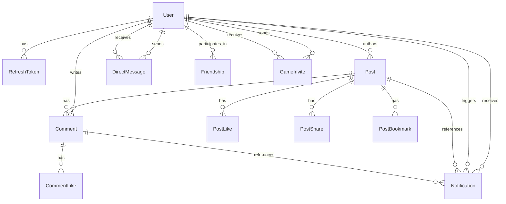

_This project has been created as part of the 42 curriculum by mstrauss, kruseva, jmuhlber, vmamoten._

# 🪐 ft_transcendence

## 📖 Description

ft_transcendence is the final project of the 42 Common Core. It is a full-stack social web application that combines community features with a real-time multiplayer Pong experience.
The goal of the project is to build a modern platform where users can create profiles, connect with other users, share content, communicate in real time, and launch live matches directly from the application. The project combines a React frontend, an Express backend, Prisma-managed PostgreSQL data, and WebSocket-powered real-time features into a single containerized application.

**Key Features:**

- **Social Platform:** User profiles, friendship management, direct messaging, notifications, and a shared social feed with posts, comments, bookmarks, and media uploads.
- **Real-Time Interaction:** Socket.IO-powered messaging, live updates, typing indicators, unread state, and in-app game invites.
- **Gameplay:** A browser-playable 3D Pong game with remote multiplayer support and live synchronized match state.
- **Technical Foundation:** A framework-based full-stack architecture using React, Express, Prisma, PostgreSQL, and a reusable custom design system.
- **User Experience:** Search, pagination, protected media handling, and integrated file upload flows for avatars, posts, and chat attachments.

---

## 🛠 Instructions

### Prerequisites

- Git
- Docker Engine or Docker Desktop
- Docker Compose v2 (`docker compose`)

### Installation & Execution

This project uses Docker for the full application stack, including the frontend, backend, database, reverse proxy, and optional Adminer instance.

1. **Clone the repository:**

   ```bash
   git clone <your-repository-url>
   cd ft_transcendence
   ```

2. **Environment Setup:**
   Create a `.env` file in the root directory based on the provided example:

   ```bash
   cp .env.example .env
   ```

   Review the following values before starting the stack:
   - `POSTGRES_USER`, `POSTGRES_PASSWORD`, `POSTGRES_DB`
   - `JWT_SECRET`
   - `PROXY_HTTP_PORT`, `PROXY_HTTPS_PORT`
   - `TLS_CERT_HOSTS`
   - `APP_ORIGIN`
   - `CORS_ALLOWED_ORIGINS`

   If you want to access the app from another machine on your network, append your host IP or domain to `TLS_CERT_HOSTS` and add the matching `https://...` origin to `CORS_ALLOWED_ORIGINS`. If you change the proxy ports or hostnames, update `APP_ORIGIN`, `TLS_CERT_HOSTS`, and `CORS_ALLOWED_ORIGINS` so they stay consistent.

3. **Run the application:**
   Build and start all services with:

   ```bash
   docker compose up --build
   ```

   On first startup, the proxy generates a self-signed TLS certificate automatically. Your browser will likely show a certificate warning for local development / deployment.

4. **Access:**
   Open your browser and navigate to:
   - `http://localhost:8080` for the HTTP entrypoint, which redirects to HTTPS.

5. **Stop the application:**

   ```bash
   docker compose down
   ```

   To remove the database volume and start with a fresh local state:

   ```bash
   docker compose down -v
   ```

   This deletes persisted database data.

---

## 👥 Team Information

| Team Member    | Role            | Responsibilities                                                    |
| :------------- | :-------------- | :------------------------------------------------------------------ |
| **[mstrauss]** | Product Owner   | Defined vision, prioritized features, maintained backlog.           |
| **[kruseva]**  | Project Manager | Facilitated coordination, tracked deadlines, managed blockers.      |
| **[jmuhlber]** | Tech Lead       | Oversaw architecture, code quality, and technology stack decisions. |
| **[vmamoten]** | Developer       | Implemented features, wrote tests, participated in code reviews.    |

---

## 📅 Project Management

**Organization:**
We organized the project as a monorepo with separate frontend, backend, database, and proxy services. Work was split into feature-focused branches and merged through pull requests rather than direct pushes to `main`. Pull Requests require the review of at the minimum one other team member in order to be merged into main.

**Task Distribution:**
Tasks were divided by feature ownership and subsystem focus:

- `mstrauss`: Pong gameplay, matchmaking/game-invite flow, real-time game integration, and performance tuning.
- `jmuhlber`: authentication, backend routes, Prisma/database work, uploads, and infrastructure fixes.
- `kruseva`: frontend UI work, chat UX, feed interactions, responsive styling, and reusable components.
- `vmamoten`: notifications, chat state handling, friends/profile features, pagination, and protected file access fixes.

**Coordination:**
We used a lightweight Agile-style workflow with bi-weekly standups and ad hoc syncs when blockers appeared. Day-to-day coordination happened through WhatsApp, and work progress was tracked through GitHub Issues and pull requests.

**Tools Used:**

- Task Tracking: GitHub Issues
- Version Control / Review: Git, GitHub branches, pull requests, peer review before merge
- Communication: WhatsApp

**Workflow:**
We used `feat/*`, `fix/*`, and `docs/*` branches, descriptive commit messages, and review-driven merges into `main`.

---

## 💻 Technical Stack

### Frontend

- **Framework:** React 19 with TypeScript and Vite
- _**Reasoning:** React provides a component-based UI architecture that fits the social feed, profile, chat, and game-shell structure of the application. TypeScript improves maintainability across shared frontend state and API-driven views, while Vite keeps the development and build pipeline fast and lightweight._

- **Routing:** React Router
- _**Reasoning:** The application mixes authenticated social views, legal pages, and a dedicated game route, so client-side routing keeps navigation predictable without adding unnecessary full-page reloads._

- **Styling / UI:** Tailwind CSS, custom reusable UI components, Lucide icons
- _**Reasoning:** Tailwind speeds up iteration on a component-heavy interface, while the custom design system keeps sidebars, dialogs, cards, forms, and status elements visually consistent across the app._

- **State / Data Access:** Zustand, Axios
- _**Reasoning:** Zustand is used for lightweight shared state such as auth, chat, notifications, and active Pong match state without introducing heavier state-management overhead. Axios provides a clear wrapper for authenticated API requests._

- **3D Rendering / Game View:** Babylon.js
- _**Reasoning:** Babylon.js was chosen to support the claimed 3D graphics module and provides a more advanced / complete feature set than three.js for the browser-based Pong experience._

### Backend

- **Framework:** Express with TypeScript
- _**Reasoning:** Express keeps the backend small and explicit while still supporting the project’s API surface for auth, posts, profiles, friends, chat, uploads, and notifications. TypeScript keeps route logic, payload handling, and shared data structures easier to maintain._

- **Real-Time Layer:** Socket.IO
- _**Reasoning:** Socket.IO supports the project’s real-time requirements for direct messaging, typing indicators, notifications, chat-related game invites, and synchronized Pong gameplay, while also helping with reconnection handling._

- **Validation / Security:** Zod, JOSE, Argon2, cookie-parser, CORS
- _**Reasoning:** Zod is used for request validation, JOSE for JWT handling, and Argon2 for password hashing. Cookie-based session handling and CORS configuration support the authenticated browser flow behind the reverse proxy._

- **File Handling:** Multer, file-type
- _**Reasoning:** These libraries support avatar uploads, post media, and chat attachments with server-side validation and controlled storage handling._

### Database

- **Database:** PostgreSQL 16
- _**Reasoning:** PostgreSQL fits the relational structure of the project well, including users, friendships, direct messages, posts, comments, notifications, and game-invite-related records._

- **ORM:** Prisma
- _**Reasoning:**_ Prisma was chosen to satisfy the ORM requirement while providing schema management, migrations, seeding, and type-safe database access across the backend.

### Infrastructure and Tooling

- **Containerization:** Docker, Docker Compose
- _**Reasoning:**_ The subject requires a containerized deployment that runs with a single command. Docker Compose provides the project’s evaluator-friendly startup path for the frontend, backend, database, and proxy.

- **Reverse Proxy / TLS:** Nginx
- _**Reasoning:**_ Nginx fronts the application, handles HTTP-to-HTTPS redirection, serves the built frontend, proxies API and WebSocket traffic, and generates the local self-signed TLS setup used by the project.

- **Database Administration:** Adminer
- _**Reasoning:**_ Adminer is included as an optional utility service for inspecting and debugging the PostgreSQL database during development.

- **Code Quality:** ESLint, Prettier
- _**Reasoning:**_ Shared linting and formatting reduce style drift across frontend, backend, and documentation updates.

---

## 🧑‍🔬 Database Schema

The project uses a PostgreSQL database modeled with Prisma. The current schema is centered around users, social content, chat, friendships, game invites, and notifications.



_Note: if your VSCode is not rendering the above mermaid diagram, install following extension [Mermaid Extension for Markdown](https://marketplace.visualstudio.com/items?itemName=bierner.markdown-mermaid)_

### Core Tables

- **User**
  Key fields: `id: String`, `username: String`, `password: String`, `email: String?`, `displayname: String`, `avatarPath: String?`
  Purpose: Stores account credentials, profile data, and acts as the parent entity for posts, comments, friendships, messages, notifications, and game invites.

- **RefreshToken**
  Key fields: `id: Int`, `userId: String`, `tokenHash: String`, `createdAt: DateTime`, `expiresAt: DateTime`, `revokedAt: DateTime?`
  Purpose: Persists refresh-token sessions for cookie-based authentication.

- **DirectMessage**
  Key fields: `id: String`, `senderId: String`, `recipientId: String`, `text: String`, `type: ChatMessageType`, `readAt: DateTime?`, `metadata: Json?`
  Purpose: Stores private chat messages, including plain text, file messages, game invites, and game notifications.

- **UserBlock**
  Key fields: `blockerUserId: String`, `blockedUserId: String`, `createdAt: DateTime`
  Purpose: Tracks chat and interaction blocking between users.

### Social Content Tables

- **Post**
  Key fields: `id: String`, `authorId: String`, `content: String`, `imagePath: String?`, `visibility: PostVisibility`, `gameTag: String?`, `likeCount: Int`, `commentCount: Int`, `shareCount: Int`, `bookmarkCount: Int`, `createdAt: DateTime`
  Purpose: Stores feed posts with optional media and visibility rules.

- **Comment**
  Key fields: `id: String`, `postId: String`, `authorId: String`, `content: String`, `likeCount: Int`, `createdAt: DateTime`, `updatedAt: DateTime`
  Purpose: Stores comments attached to posts.

- **PostLike**
  Key fields: `postId: String`, `userId: String`, `createdAt: DateTime`
  Purpose: Join table for post likes.

- **PostShare**
  Key fields: `postId: String`, `userId: String`, `createdAt: DateTime`
  Purpose: Join table for post shares.

- **PostBookmark**
  Key fields: `postId: String`, `userId: String`, `createdAt: DateTime`
  Purpose: Join table for bookmarked posts.

- **CommentLike**
  Key fields: `commentId: String`, `userId: String`, `createdAt: DateTime`
  Purpose: Join table for comment likes.

### Relationship and Game Tables

- **Friendship**
  Key fields: `id: Int`, `userOneId: String`, `userTwoId: String`, `requesterId: String`, `addresseeId: String`, `status: FriendshipStatus`, `acceptedAt: DateTime?`
  Purpose: Represents friend requests and accepted friendships between two users.

- **GameInvite**
  Key fields: `id: String`, `gameType: GameType`, `senderId: String`, `recipientId: String`, `status: GameInviteStatus`, `expiresAt: DateTime`, `matchId: String?`
  Purpose: Stores Pong invitations sent through chat and tracks their lifecycle.

- **Notification**
  Key fields: `id: String`, `recipientId: String`, `actorId: String?`, `type: NotificationType`, `postId: String?`, `commentId: String?`, `createdAt: DateTime`, `readAt: DateTime?`
  Purpose: Stores in-app notifications for post and comment activity as well as friendship-related interactions.

### Main Relationships

- One `User` can own many `Post`, `Comment`, `RefreshToken`, `DirectMessage`, `GameInvite`, and `Notification` records.
- `Post` belongs to one `User` and has many `Comment`, `PostLike`, `PostShare`, `PostBookmark`, and `Notification` records.
- `Comment` belongs to one `Post` and one `User`, and can have many `CommentLike` and `Notification` records.
- `Friendship` connects two users and separately records who requested and who received the request.
- `DirectMessage` links one sender user and one recipient user.
- `GameInvite` links one sender user and one recipient user and stores the invite state for Pong matches.
- `Notification` belongs to one recipient user and can optionally reference an actor user, a post, or a comment.

### Important Enums

- `ChatMessageType`: `TEXT`, `GAME_INVITE`, `GAME_NOTIFICATION`, `FILE`
- `GameType`: `PONG`
- `GameInviteStatus`: `PENDING`, `ACCEPTED`, `DECLINED`, `EXPIRED`, `CANCELED`
- `FriendshipStatus`: `PENDING`, `ACCEPTED`
- `PostVisibility`: `PUBLIC`, `FRIENDS`
- `NotificationType`: `POST_LIKE`, `POST_COMMENT`, `POST_SAVE`, `COMMENT_LIKE`

---

